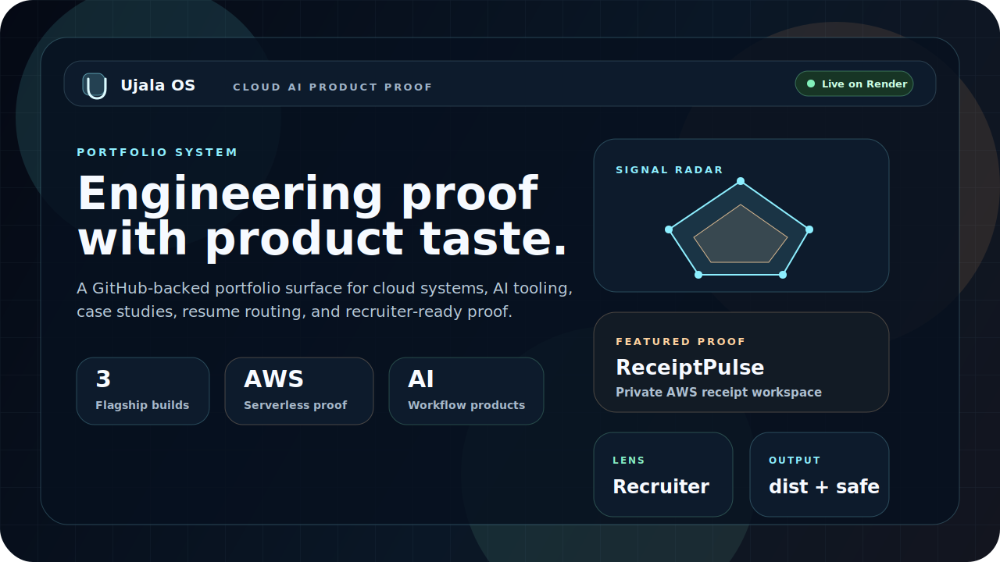
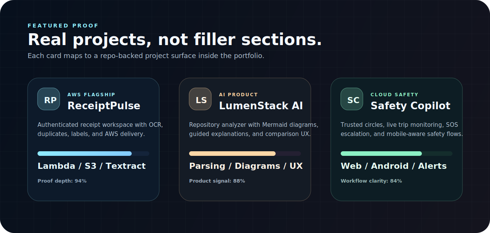
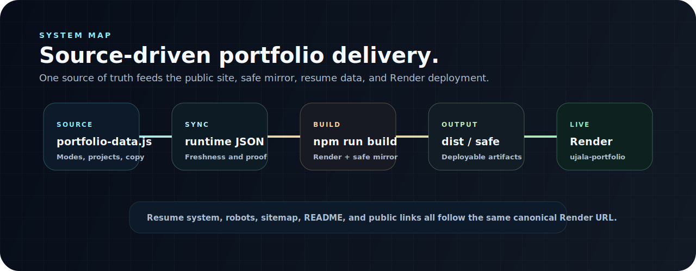

<p align="center">
  
</p>

<p align="center">
  <a href="https://ujala-portfolio.onrender.com/"></a>
  
  
</p>

<h1 align="center">Ujala Portfolio OS</h1>

<p align="center">
  A high-polish portfolio system for engineering proof, product taste, cloud systems, AI tooling, resume routing, and recruiter-ready storytelling.
</p>

<p align="center">
  <a href="https://ujala-portfolio.onrender.com/"><strong>Live Experience</strong></a>
  |
  <a href="https://www.linkedin.com/in/ujala-agarwal-30aa28283/">LinkedIn</a>
  |
  <a href="https://github.com/agarwalujala3-lang">GitHub</a>
</p>

<p align="center">
  
</p>

## What This Is

`ujala-portfolio` is a multi-page portfolio product built to make proof easy to inspect.

The experience brings together polished frontend design, real project pages, audience-aware storytelling, resume data, GitHub-backed freshness, and Render deployment output. The goal is simple: make the work feel credible within the first screen and deeper as someone explores.

## Why It Stands Out

<table>
  <tr>
    <td width="50%" valign="top">
      <h3>Product-Grade Presentation</h3>
      <p>The site uses a premium dark visual system, cinematic hero composition, motion, proof cards, charts, section-specific panels, and cleaner interaction details.</p>
    </td>
    <td width="50%" valign="top">
      <h3>Proof Before Claims</h3>
      <p>ReceiptPulse, LumenStack AI, and Safety Copilot are presented as evidence surfaces with live links, repos, tradeoffs, and architecture context.</p>
    </td>
  </tr>
  <tr>
    <td width="50%" valign="top">
      <h3>Audience-Aware Narrative</h3>
      <p>The portfolio can shift emphasis for recruiters, engineers, founders, and personal readers while keeping the underlying work consistent.</p>
    </td>
    <td width="50%" valign="top">
      <h3>Deployable System</h3>
      <p>Source content, runtime data, resumes, SEO files, generated output, and Render configuration are kept aligned through repeatable build scripts.</p>
    </td>
  </tr>
</table>

## Visual Proof Board

<p align="center">
  
</p>

| Project | Signal | Proof |
| --- | --- | --- |
| `ReceiptPulse` | AWS receipt workspace | Auth, upload, OCR extraction, duplicate review, label management, dashboard flow |
| `LumenStack AI` | AI architecture analyzer | Repository parsing, Mermaid diagrams, guided explanations, comparison UX |
| `Safety Copilot` | Cloud safety platform | Trusted circles, trip monitoring, SOS escalation, web and Android surfaces |

## Experience Modes

| Mode | What It Optimizes |
| --- | --- |
| `Recruiter` | Fast signal, role fit, strongest projects, clean resume access |
| `Engineer` | Architecture pages, tradeoffs, repo credibility, implementation depth |
| `Founder` | Product judgment, usability, polish, execution quality |
| `Friend` | Journey, personality, learning path, human context |

## Core Pages

| Page | Role |
| --- | --- |
| `index.html` | Premium homepage with hero proof, visual telemetry, mode switching, and featured work |
| `work.html` | Project page for proof, delivery details, links, and comparison |
| `systems.html` | Architecture page for engineering readers and technical review |
| `about.html` | Journey, principles, learning arc, and working style |
| `playground.html` | Current experiments, roadmap, learning log, and idea inbox |
| `contact.html` | Contact options, public profiles, and resume access |

## Architecture

<p align="center">
  
</p>

| Layer | Files |
| --- | --- |
| Source of truth | `portfolio-data.js`, `resume-data.js`, `content/*.json` |
| Runtime state | `portfolio-runtime.json`, `resume-runtime.json` |
| Rendering | `app-core.js`, `app-render.js`, `app-main.js` |
| Visual system | `styles.css`, `content/*.svg` |
| Public output | `dist/` |
| Standalone mirror | `safe/` |
| Deployment | `render.yaml`, `robots.txt`, `sitemap.xml` |

## Tech Stack

```text
Frontend: HTML, CSS, JavaScript
Data: Static JS and JSON sources
Rendering: App shell plus page-specific render logic
Visuals: SVG assets, CSS motion, responsive product UI surfaces
Resumes: HTML/PDF resume pipeline
Deployment: Render static site, publish directory dist/
```

## Local Workflow

```bash
node local-server.js
```

Open `http://127.0.0.1:4173`.

```bash
npm run sync
npm run build:render
npm run build:safe
npm run build
npm run refresh
npm run export:resumes
```

## Render Deployment

Canonical URL:

```text
https://ujala-portfolio.onrender.com/
```

Render settings:

```text
Service type: Static Site
Branch: main
Build command: npm run build:render
Publish directory: dist
Environment: PUBLIC_SITE_BASE=https://ujala-portfolio.onrender.com
```

The repository includes `render.yaml` so the deployment contract is visible in source control.

## Quality Bar

This portfolio is maintained like a public product surface:

- No stale live links across README, SEO files, resume data, and generated output
- No horizontal overflow across desktop and mobile smoke checks
- No console errors in the primary routes
- Clear canonical URL alignment with Render
- Visual polish that supports the proof instead of burying it

## Current Focus

| Track | Direction |
| --- | --- |
| Frontend polish | Keep the premium system sharp while preserving readability and usability |
| Project depth | Push ReceiptPulse, LumenStack AI, and Safety Copilot into clearer proof surfaces |
| Resume sync | Keep portfolio, resume data, and public links aligned |
| Deployment maturity | Keep Render as the canonical live home and generated output clean |

## Contact

<p align="center">
  <a href="https://ujala-portfolio.onrender.com/">Portfolio</a>
  |
  <a href="https://www.linkedin.com/in/ujala-agarwal-30aa28283/">LinkedIn</a>
  |
  <a href="https://github.com/agarwalujala3-lang">GitHub</a>
</p>
